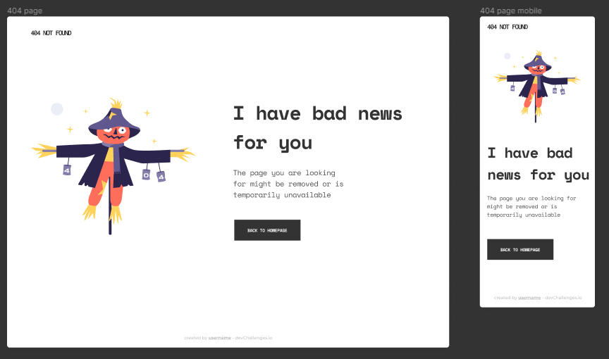

<h1 align="center">404 Not Found</h1>

   Solution for a challenge from  <a href="http://devchallenges.io" target="_blank">Devchallenges.io</a>.

  <h3>
    <a href="https://liliantavarez.github.io/404-not-found/">
      Solution
    </a>
     | 
    <a href="https://devchallenges.io/challenges/wBunSb7FPrIepJZAg0sY">
      Challenge
    </a>
  </h3>

 
<strong>Challenge:</strong> Create a 404 not found page following the design. The page should be responsive. Fulfill user stories below:

 <ul>
  <li><strong>User story:</strong> I can see a page following the given design</li>
 </ul>
 

## Contact

- LinkedIn [@LilianTavarez](https://www.linkedin.com/in/liliantavarez/)
- GitHub [@LilianTavarez](https://github.com/liliantavarez)
- Twitter [@LilianTavarez](https://twitter.com/liliantavarez)
